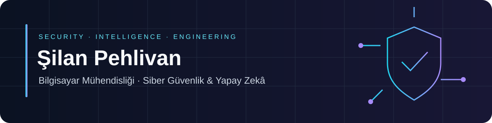

Bilgisayar mühendisliği eğitimimi güvenlik analizi, makine öğrenmesi ve uygulama geliştirme projeleriyle birleştiriyorum.

## Seçili projeler

<table>
<tr>
<td width="50%">
<h3>🛡️ CYBER-PULSE</h3>

IT/OT izleme, yapay zekâ ile anomali analizi ve güvenlik olaylarına müdahaleyi birleştiren platform.

<code>Python</code> <code>FastAPI</code> <code>AI / SOAR</code>

<a href="https://github.com/silanpehlivan/CYBER-PULSE">Projeyi keşfet →</a>

Özel depo · Geliştirme aşamasında

</td>
<td width="50%">
<h3>🏢 HoldingOps</h3>

Çok şirketli yapılar için BT operasyonları, güvenlik izleme ve AI destekli karar yönetimi.

<code>Python</code> <code>React / TypeScript</code> <code>AI / RAG</code>

<a href="https://github.com/silanpehlivan/HoldingOps">Projeyi keşfet →</a>

Özel depo · Geliştirme aşamasında

</td>
</tr>
<tr>
<td width="50%">
<h3>🛡️ PhishGuard ML</h3>

URL risk göstergelerini makine öğrenmesiyle birleştiren oltalama analizi prototipi.

<code>Python</code> <code>FastAPI</code> <code>React</code>

<a href="https://github.com/silanpehlivan/PhishGuard-ML">Projeyi keşfet →</a>
</td>
<td width="50%">
<h3>🔐 AI Cryptanalyst</h3>

Şifreli metinler için algoritma tahmini, istatistiksel analiz ve çözümleme araçları.

<code>Python</code> <code>Streamlit</code> <code>Machine Learning</code>

<a href="https://github.com/silanpehlivan/AI-Cryptanalyst">Projeyi keşfet →</a>
</td>
</tr>
<tr>
<td width="50%">
<h3>🌿 Flower Classifier</h3>

MobileNetV2 özellikleri ve SVM ile fotoğraftan çiçek sınıflandırma.

<code>TensorFlow</code> <code>Flask</code> <code>Computer Vision</code>

<a href="https://github.com/silanpehlivan/FlowerProject">Projeyi keşfet →</a>
</td>
<td width="50%">
<h3>⚡ HeroScript</h3>

Oyun senaryolarıyla programlama kavramlarını keşfetmek için mini dil ve tarayıcı IDE’si.

<code>Language Design</code> <code>Browser IDE</code>

<a href="https://github.com/silanpehlivan/HeroScript">Projeyi keşfet →</a>
</td>
</tr>
</table>

**Projelerimde kullandığım teknolojiler**

[Tüm projelerime göz at →](https://github.com/silanpehlivan?tab=repositories)

Şilan Pehlivan · Siber güvenlik, yapay zekâ ve yazılım geliştirme

